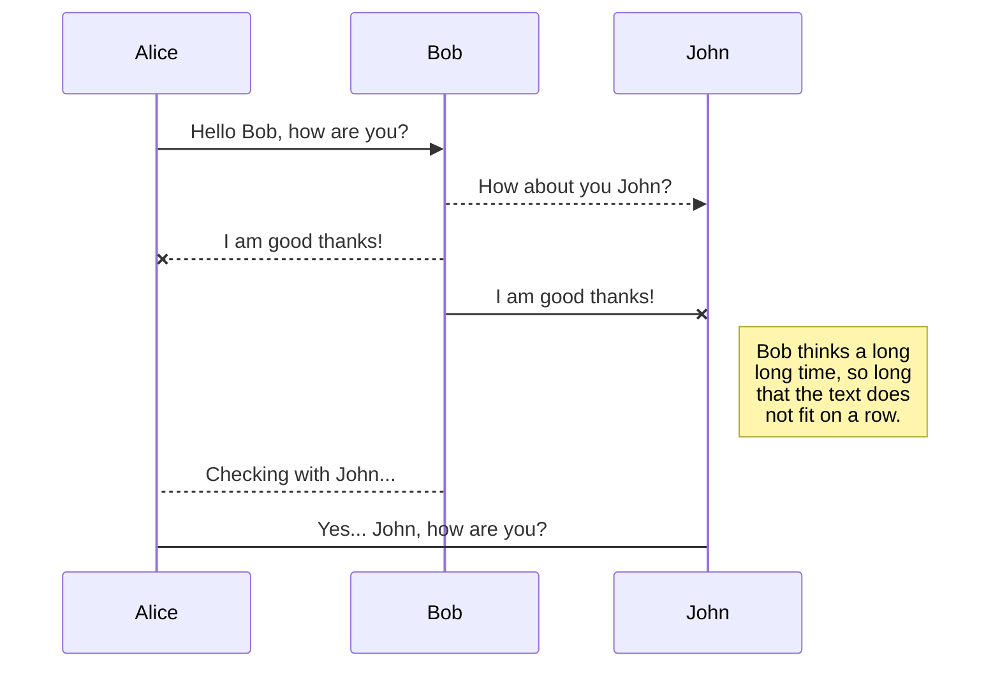

# Electronics Inventory Documentation

<p>
  
  
  
  <a href="https://github.com/joshl26/electronics-inventory-frontend#readme" target="_blank">
    
  </a>
  <a href="https://github.com/joshl26/electronics-inventory-frontend/graphs/commit-activity" target="_blank">
    
  </a>
  <a href="https://github.com/joshl26/electronics-inventory-frontend/blob/master/LICENSE" target="_blank">
    
  </a>
</p>


**Table Of Contents**

- [Introduction](#introduction)
- [Live Demo](#live-demo)
- [Code Repositories](#code-repositories)
- [Project Setup](#project-setup)
- [Folder Structure](#folder-structure)
- [Database Architecture](#database-architecture)
- [API Payload](#api-payload)
- [Usage - Home Page](#usage---home-page)
- [Usage - Parts List](#usage---parts-list)
- [Usage - New Part](#usage---part-new)
- [Usage - Users List](#usage---users-list)
- [Usage - New User](#usage---new-user)
- [Testing](#testing)
- [Contributions](#contributions)

If you would like to see my progress throughout the development of this application, please take a look at my posts on LinkedIn: [here](https://www.linkedin.com/in/joshrlehman/).

<a name="introduction"></a>

## Introduction

Electronics Inventory is a cutting-edge SAAS webapp that efficiently organizes electronic lab inventory for both small businesses and individuals with ease. With its user-friendly interface, you can effortlessly keep track of thousands of small components and have complete command over your inventory from anywhere in the world. To take advantage of this revolutionary app, you must have an account. I am proud to say that I created this project from scratch as a capstone project for my career change into Software Engineering.

<a name="live-demo"></a>

## Live Demo

- [Live Demo](https://el-in.ca)

<a name="code-repositories"></a>

## Code Repositories

- [Electronics Inventory Frontend (Client) Code](https://github.com/joshl26/electronics-inventory-frontend)

- [Electronics Inventory Backend (Server) Code](https://github.com/joshl26/electronics-inventory-backend)

<a name="api-documentation"></a>

## API Documentation

- [Live API Documentation](https://electronics-inventory-server.onrender.com/api-docs/)

<a name="functionalities"></a>

## Functionalities

- The user will have to login to edit the inventory details.

- The user can only edit/delete the inventory that they have access too.

- All the data will pe persistent and is stored in the amazon cloud.

<a name="technologies-utilized"></a>

## Technologies Utilized

- HTML5 - A markup language for creating web pages and web applications.

- CSS3 - used for describing the presentation of a document written in a markup language.

- Bootstrap - A free and open-source front-end web framework for designing websites and web applications quickly.

- Node.js - Open-source, cross-platform JavaScript run-time environment for executing JavaScript code server-side.

- Express.js - For building web applications and APIs and connecting middleware.

- Joi - Used for schema description and data validation.

- Swagger-UI/JSDOC - Powerful UI interface for documenting, testing and displaying API endpoints.

- UMLs - Unified Modeling Language diagrams which illustrate the sequence of events between objects within this app.

- REST - REST (REpresentational State Transfer) is an architectural style for developing web services.

- MongoDB - Open-source cross-platform document-oriented NoSQL database program to store details like user info, campsites info and comments.

- PassportJS - Authentication middleware for Node.js. Extremely flexible and modular, Passport can be unobtrusively dropped into any Express-based web application.

- Data Associations - Associating user data with the respective campsites and comments using the reference method.

- Render.com - Cloud platform as a service used as a web application deployment model.

- AWS - Mongodb is hosted on Amazon ec2 instance.

<a name="project-setup"></a>

## Project Setup

Electronics inventory uses Javascript so you will need node.js installed to run this application, which includes downloading its dependencies. If you don't have node installed you can get that [here](https://nodejs.org/en/).

You will also need `git` installed on your computer. You can download it [here](https://git-scm.com/downloads).

Next open a git bash wherever you would like to store electronics inventory and run:

### Frontend (Client) installation

`git clone https://github.com/joshl26/electronics-inventory-frontend`

Once you have the project on your local machine you will want open it in a new terminal window and run:

`npm install`

This command will install the client side dependencies, this may take a bit of time.

Once the installation of the dependencies is complete you can start the project by typing the following command:

`npm run start`

and you will have the development version of the frontend (client) application running on:

`localhost:3000`

### Backend (Server) installation

`git clone https://github.com/joshl26/electronics-inventory-backend`

Once you have the project on your local machine you will want open it in a new terminal window and run:

`npm install`

This command will install the server side dependencies, this may take a bit of time.

Once the installation of the dependencies is complete you can start the project by typing the following command:

`node server`

and you will have the development version of the backend (server) application running on:

`localhost:3500`

<a name="folder-structure"></a>

## Folder Structure

**Backend File Structure**

```
/electronics-inventory-backend
    /config
        /allowedOrigins.js
        /corsOptions.js
        /dbConn.js
    /controllers
        /authController.js
        /notesController.js
        /partsController.js
        /userController.js
    /logs
        /reqLog.log
    /middleware
        /errorHandler.js
        /logger.js
        /loginLimiter.js
        /verifyJWT.js
    /models
        /Note.js
        /Part.js
        /User.js
    /routes
        /authRoutes.js
        /noteRoutes.js
        /partRoutes.js
        /root.js
        /userRoutes.js
    /views
        /404.html
        /index.html
    /server.js
```

I followed the MVC (Model-View-Controller) architectural pattern when laying out this application. It is an architectural pattern used in software engineering to separate the representation of information from the user's interaction with it.

The MVC format for Node.js involves separating application logic into three distinct components: Models, Views, and Controllers.

Models are responsible for managing data and business rules within an application. They handle interactions between a database and controller by performing CRUD operations on objects stored in memory or persisted in databases like MongoDB.

Views are responsible for displaying output to the user interface as HTML pages, written using EJS (Embedded JavaScript).

Controllers are responsible for coordinating models and views by responding to user input and making changes to data when required. It acts as a bridge between view layer (user interface) and model layer(data access layer). Controllers also contain request handlers that interpret requests coming from users via URLs/HTTP methods such as GET/POST.

**Client Side Layout**

```
/client
    /node_modules
    /public
        /favicon.ico
        /index.html
    /src
        /components
            /CreateModal
                /CreateModal.js
            /EditModal
                /EditModal.js
            /InventoryItem
                /InventoryItem.js
            /LoadingDefault
                /LoadingDefault.js
            /LoadingIcon
                /LoadingIcon.js
            /OrderItem
                /OrderItem.js
            /OrderModal
                /OrderModal.js
            /popupModals
                /confirmModal.js
            /SideBar
                /MobileSideBar.js
                /SideBar.js
            /UserItem
                /UserItem.js
            /VariantComponents
                /AddVariant.js
                /CurrentVariant.js
        /pages
            /InventoryPage.js
            /MainPage.js
            /SoldPage.js
            /StatsPage.js
            /UserPage.js
        /utils
            /helpers
                /__test__
                    /categoryStats.test.js
                    /ordersMain.test.js
                    /productStats.test.js
                    /shippingStats.test.js
                /categoryStats.herlpers.js
                /fetchFunction.helpers.js
                /ordersMain.helpers.js
                /productStats.helpers.js
                /shippingStats.helpers.js
        /App.js
        /index.css
        /index.js
        /reportWebVitals.js
        /setupTests.js
    /.gitignore
    /package-lock.json
    /package.json
    /postcss.config.js
    /README.md
    /tailwind.config.js
```

Now that I've shown off the bones of the project, let me show you a bit of the brains behind it all.

<a name="database-architecture"></a>

## Database Architecture


This design had been a bit tricky throughout its implementation however it should be fairly self explanatory. `Category` has many `clothing_item` which contains `color` and by extension `clothing_stock`. Color in this case refers to any sort of variant you can have on your clothing item.

`Order` belongs to `user` and contains `shipping`. Users create their `user` model before checkout and their order is assigned to that model. The shipping also gets attached depending on which shipping is chosen.

So now that we have discussed the way the backend works let me go over the frontend.

<a name="API Payload"></a>

## API Payload

```js
const CreatePayload = {
  name: "Test Item",
  price: 200,
  description: "This is an update test item",
  color: [{ color: "purple" }, { color: "orange" }, { color: "black" }],
  clothing_stock: [
    { xs: 2, s: 40, m: 22, l: 13, xl: 12 },
    { xs: 2, s: 40, m: 22, l: 13, xl: 12 },
    { xs: 2, s: 40, m: 22, l: 13, xl: 12 },
  ],
};
```

Above is an example of the payload being sent to the backend upon creating an item. The `color` array is made up of colors/variants that are added while the `clothing_stock` array is made up of the corresponding stock values. Because of this the lengths of `color` and `clothing_stock` arrays are the same. Each array item is its own row being added into the database. The parent object `clothing_item` is made up of the `name`, `price`, and `description` key value pairs and is created first when sent to the API. From here a `clothing_id` will be sent to the `color` and `clothing_stock` objects upon their creation to point to the parent `clothing_item` they describe.

```js
const EditPayload = {
  clothing_id: 1,
  name: "Test Item",
  price: 200,
  description: "This is an update test item",
  color: [
    { color: "purple", id: 1 },
    { color: "orange", id: 2 },
    { color: "black", id: 3 },
  ],
  clothing_stock: [
    { xs: 2, s: 40, m: 22, l: 13, xl: 12, id: 1 },
    { xs: 2, s: 40, m: 22, l: 13, xl: 12, id: 2 },
    { xs: 2, s: 40, m: 22, l: 13, xl: 12, id: 3 },
  ],
  added_color: [{ color: "testing", xs: 2, s: 40, m: 22, l: 13, xl: 12 }],
  deleted_color: [{ color_id: 1, stock_id: 2 }],
};
```

Above is an example of the payload that is sent upon making a `PUT` request to the API. The main differences being the presence of the `clothing_id` and `id` tags that were not found in the `CreatePayload` object. These of course are needed to get reference to the objects being updated. Now the way that this payload works is a lot more intricate than the previous one. It essentially starts out as a bare bones object until an edit is made to the item.

```js
const EditPayload = {
  clothing_id: 1,
  name: "Test Item",
  price: 200,
  description: "This is an update test item",
  color: [],
  clothing_stock: [],
  added_color: [],
  deleted_color: [],
};
```

Without making any changes the payload will be seen as it is above. Making changes to colors that are already on the `clothing_item` will add the change into the `color` array and as such will act in an update. Same will happen with the corresponding `clothing_stock` array. If a color is added it will be added into the `added_color` array and as such will be treated as a create.

```js
added_color: [{ color: "testing", xs: 2, s: 40, m: 22, l: 13, xl: 12 }];
```

The `added_color` array handles the creation of both the `color` and `clothing_stock` with the color coming first and the stock values second, shown above.

```js
deleted_color: [{ color_id: 1, stock_id: 2 }];
```

The `deleted_color` array handles deletion of colors. Once a color is deleted its id as well as stock id get stored as an object in the `deleted_color` array, shown above. This data is all that is needed to grab the rows and delete them.

This system took a while to figure out and ultimately allows for editing, creation, and deletion of not only a `clothing_item` but simultaneously its `color` and by extension its `clothing_stock` utilizing a single payload. The arrays are handled in the API by **ForEach** and **For** loops allowing to check array lengths and if, for example, the `deleted_color` method contains no values then skip that function entirely.

<a name="usage-homepage"></a>

## Usage - Home Page


This is the home page of the content management system dashboard. This page shows a general overview of your shop and gives some import data from each of the tabs listed in the sidebar. Clicking any of the links will take you to their respective page and function the same as if you were to click them on the sidebar.

<a name="usage-inventory"></a>

## Usage - Inventory

**Inventory Page**


While in the inventory page tab, you will be met with your entire inventory. This includes all of the clothing_item objects you have created as well as their variants/colors. For the first clothing item listed, in order from left to right, you can see the item name, its price, and the total stock. Below that is a list of colors. Clicking on a color will open up a tab displaying all of the current stock numbers and their correlating sizes.

**Edit Inventory Modal**


Clicking on the edit button to the far left will spawn a modal with all of the selected clothing item's data. From here you can edit all of the various attributes involved with the creation of a clothing item. This includes colors/variants as well as stock. The way I created the payload to handle this particular method of editing may be a bit far fetched but it is working and works to scale.

To add a color click the plus button in the far most bottom left corner of the modal. Clicking the close button will exit the modal without saving any currently made changes, and clicking the save button will submit the changes made.

**Delete Color Modal**


Upon clicking the red minus button found below each color you will be met with another modal asking if you would like to confirm the deletion of the color. Selecting **Delete** will remove the color and **cancel** will close the modal without any changes.

**Create Item Modal**


Going back to the **Inventory Page** and clicking the **Add Item** button in the bottom right corner you will be met with a modal similar to the **Edit Inventory Modal** however this one is completely empty and yours to fill out. The functionalities are the exact same between the two modals.

**Delete Item Modal**


Selecting the **Delete** button to the right of the **Edit** button found to the top right of each clothing item will bring up a modal asking "Are You Sure You Want To Delete This Item?". Selecting **Delete** will remove the selected clothing item and selecting cancel will close the modal without any changes.

<a name="Usage - Sold"></a>

## Usage - Sold

**Sold Page**


Clicking on the **Sold** text in the sidebar will take you to the sold page where you will see a listing of all of your sales/orders. In order from right to left you'll see the item name, price, shipping type, date ordered, order number, fulfilled checkbox and a button to click for more details on that order.

Clicking the checkbox to either check fulfilled or uncheck will immediately edit the selected order item. If checked then **order_status** will be set to true, and if unchecked it will be set to false.


Clicking the **Details** button at the far right will open up a modal with the information corresponding to the selected order. This shows even more information and is a sort of receipt for the shop owner to view.

<a name="Usage - Users"></a>

## Usage - Users

**Users Page**


This page lists the users in your store and displays the orders per user. This page is fairly similar to the **Sold Page** in that it has about the same order information however the top of each section has the users name, email, and join date.

Clicking the details button next an order will open a modal with the same information found in the **Sold Page** order modal.

<a name="Usage - Statistics"></a>

## Usage - Statistics

**Statistics Page**


Clicking on the **Statistics** text in the sidebar will take you to the statistics page. This page displays useful numbers in relationship to sales as well as costs to take into consideration when running your business.

This page utilizes chartjs and react-chartjs-2 to create these really nice looking graphs.

At the top you'll see your income per day and below that you can see your total costs and total income. These numbers are color coded and include the shipping income, shipping costs, item income, and item costs.


Moving to the middle of the page you'll see income by category. This is displayed in a polar area chart. You can visualize sale percentage as well as view the actual amount from just looking.


At the bottom of the page is where you will find the stock numbers of all the inventory in your store. Total stock being the culmination of everything you are selling. Unique stock is the amount of individual items you are selling, not including their colors/variants. Then you have your stock per category which is generated based on the categories you have set up.

<a name="Usage - Mobile"></a>

## Usage - Mobile

While there aren't a lot of discrepancies between the desktop and mobile versions of the application there is one big difference.


The sidebar is now hidden and is controlled by a button in the top right hand corner. Clicking this button will open up the sidebar and you can navigate through the pages from there.


The sidebar layout is the same just instead of text there are now icons representing each page you can navigate to.

<a name="Testing"></a>

## Testing

While my tests don't have the most coverage or test any of the currently setup react portions of my project. I do have some unit tests which run checks on the helper functions to ensure that things are not going wrong when information comes from the backend into the frontend.

Tests can be found in the client folder `/client/src/utils/helpers/__test__`

While in the root folder, running `cd client && npm run test` in the terminal will run the tests I currently have setup.

## Screenshots

> HomePage
> 

> Customers
> 

> Electronics Inventory Dashboard
> 

> Login & Register page
> 

## Author

👤 **Joshua Lehman**

## Portfolio

- [joshlehman.ca](https://joshlehman.ca)

## Github

- [joshl26](https://github.com/joshl26)

## LinkedIn

- [joshrlehman](https://www.linkedin.com/in/joshrlehman/)

## 🤝 Contributing

<a name="Contributions"></a>
Contributions, issues and feature requests are welcome!<br />Feel free to check [issues page](https://github.com/joshl26/electronics-inventory-frontend/issues). You can also take a look at the [contributing guide](https://github.com/joshl26/electronics-inventory-frontend/blob/master/CONTRIBUTING.md).

## Show your support

Give a ⭐️ if this project helped you!

## 📝 License

Copyright © 2023 [Joshua Lehman](https://github.com/joshl26).<br />
This project is [ISC](https://github.com/joshl26/electronics-inventory-frontend/blob/master/LICENSE) licensed.


